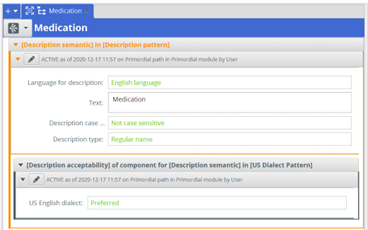
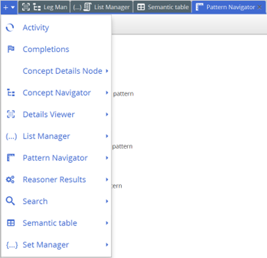
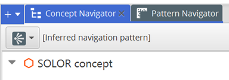
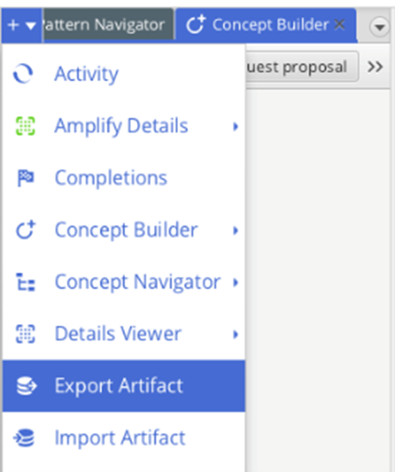
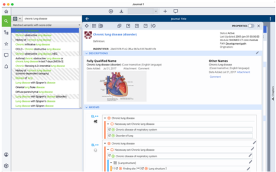
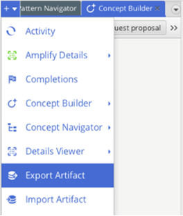
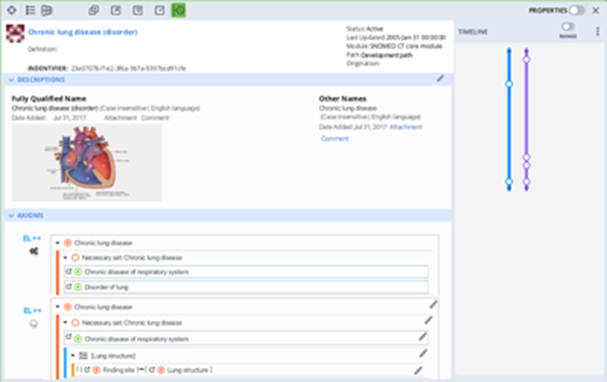
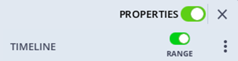

import DropdownTabs from '@site/src/components/DropdownTabs';
import styles from './info.module.css';

# Informaticists

## How To Find A Concept
### Komet Interface
1.	Type the keyword or concept name into the "enter search query" bar in the Search activity stream (default location: right panel) to find a concept

Results containing the keyword will populate in the field below the search bar, with keywords highlighted in green
2.	Click on a result to view more details in the center panel
#### How to View Details
1.	To view a concept, click or drag it to the Detail Viewer activity stream (default location: center panel) 
2.	Use the tabs at the top of the Detail Viewer activity stream (default location: center panel) to view various details and information about the selected concept, such as description semantic

3.	Use the “+” drop down to select additional tabs to display information or to re-open a closed tab for a certain 

4.	You can select the language and/or dialect for the concept you want to display
#### How to Visualize Hierarchical 
1.	To view hierarchical relationships, utilize the “Concept Navigator” and “Pattern Navigator” tabs in the Navigation activity stream (default location: left panel)

2.	These tabs can also be found when viewing a concept in the Detail Viewer activity stream (default location: center panel) by clicking the “+” drop down menu 
3.	Utilize the arrows within the Navigation activity stream (default location: left panel) to collapse or expand hierarchical relationships 
4.	The Detail Viewer activity stream (default location: center panel) can display additional views, including: 
-	Description Semantic with language and dialect 
-	Relationship destination and relationship origin 
-	EL++ Stated terminological axioms showing hierarchical relationships
### Journal Interface
1.	In the global navigation menu to the left, click the magnifying glass to open the search tray 
2.	Type a concept name in the search field and press Enter. A list of related results will appear

#### How to View Details
1.	In the search results, double click the concept you wish to view. A concept window with concept details will open to the right

## Exporting and Sharing Data
### Komet Interface
1.	Select the concept or concepts you would like to export on the Navigation activity stream (default location: left panel) a. Use shift or control click to select multiple concepts 
2.	Right click and select export OR use the “+” dropdown menu and select "Export Artifact"

## Viewing Concept Timeline Properties
### Journal Interface
1.	In the tool ribbon at the top of the concept window, click the green Time Travel button

The Timeline panel opens to the right. Colored lines in the Timeline panel represent different data extensions.

2.	Click the three vertical dots on the right to view Timeline settings. You can change which extensions you wish to view in the Timeline panel

3.	Click the Properties toggle on the right, above the Timeline panel, to enable the Properties panel

This opens the Properties panel between the concept details view and the Timeline panel. The Properties panel contains options for the Edit, Hierarchy, History, and Comments views

4.	Click the History view in the Properties panel. The History view shows event details for each event dot on the Timeline extension(s)

<!-- </img> -->

5.	Click the Range toggle below the Properties toggle to enable range selection on the timeline

This allows you to select event dots you wish to view within a specific time range.

When you define a specific time range, the History view only shows event details for event dots contained within that time range. When an event dot is selected, the dot turns green and the corresponding historical record is outlined red.

6.	Click the dropdown at the top of the History view to filter historical records by Concept, Description, and Axiom change events

 
